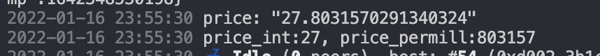
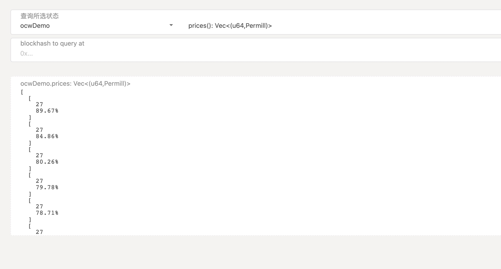

# 第四课作业 (源码在pallets/owc)

### 关键代码

#### 使用 unsigned tx with signed payload 的方式 ，保证安全而又无需手续费上链存储
```rust


		#[pallet::weight(10000)]
		pub fn submit_dot_price_unsigned_with_signed_payload(
			origin: OriginFor<T>,
			payload: PricePayload<T::Public>,
			_signature: T::Signature,
		) -> DispatchResult {
			let _who = ensure_none(origin)?;

			let PricePayload { price, public } = payload;

			log::info!("submit_dot_price_unsigned_with_signed_payload: ({:?}, {:?})", price, public);

			Prices::<T>::mutate(|prices| {
				if prices.len() == NUM_VEC_LEN {
					let _ = prices.pop_front();
				}
				prices.push_back(price);
			});

			Self::deposit_event(Event::NewPrice(price));
			Ok(())
		}


```

###  fetch_price_info 部分代码，通过对应api获取价格

```rust
	fn fetch_price_info() -> Result<(), Error<T>> {
			// TODO: 这是你们的功课

			// 利用 offchain worker 取出 DOT 当前对 USD 的价格，并把写到一个 Vec 的存储里，
			// 你们自己选一种方法提交回链上，并在代码注释为什么用这种方法提交回链上最好。只保留当前最近的 10 个价格，
			// 其他价格可丢弃 （就是 Vec 的长度长到 10 后，这时再插入一个值时，要先丢弃最早的那个值）。

			// 取得的价格 parse 完后，放在以下存儲：
			// pub type Prices<T> = StorageValue<_, VecDeque<(u64, Permill)>, ValueQuery>

			// 这个 http 请求可得到当前 DOT 价格：
			// [https://api.coincap.io/v2/assets/polkadot](https://api.coincap.io/v2/assets/polkadot)。

			let signer = Signer::<T, T::AuthorityId>::any_account();

			let mut lock = StorageLock::<BlockAndTime<Self>>::with_block_and_time_deadline(
				b"offchain-demo::dot-price::lock",
				LOCK_BLOCK_EXPIRATION,
				rt_offchain::Duration::from_millis(LOCK_TIMEOUT_EXPIRATION),
			);

			if lock.try_lock().is_err() {
				return Ok(());
			}


			let resp_bytes = Self::fetch_from_remote(DOT_PRICE_API).map_err(|e| {
				log::error!("fetch price api error: {:?}", e);
				<Error<T>>::HttpFetchingError
			})?;

			let resp_str = str::from_utf8(&resp_bytes).map_err(|_| <Error<T>>::HttpFetchingError)?;
			log::info!("resp_str:{}", resp_str);


			let root: Value = serde_json::from_str(&resp_str).map_err(|_| <Error<T>>::InvalidPriceValueError)?;
			let price_option: &str  = root.get("data")
				.and_then(|value| value.get("priceUsd"))
				.and_then(|value| value.as_str()).ok_or(<Error<T>>::InvalidPriceValueError)?;
			
			match Self::get_decimal(price_option) {
				Ok((integer_part, fractional_part)) => {
					if let Some((_, res)) = signer.send_unsigned_transaction(
						|acct| PricePayload {
							price: (integer_part, fractional_part),
							public: acct.public.clone(),
						},
						Call::submit_dot_price_unsigned_with_signed_payload,
					) {
						return res.map_err(|_| {
							log::error!("Failed in submit_dot_price_unsigned_with_signed_payload");
							<Error<T>>::OffchainUnsignedTxSignedPayloadError
						});
					}
		
				},
				Err(err) => { return Err(err); }
			};


			Err(<Error<T>>::NoLocalAcctForSigning)
		}


```


###### 运行截图







